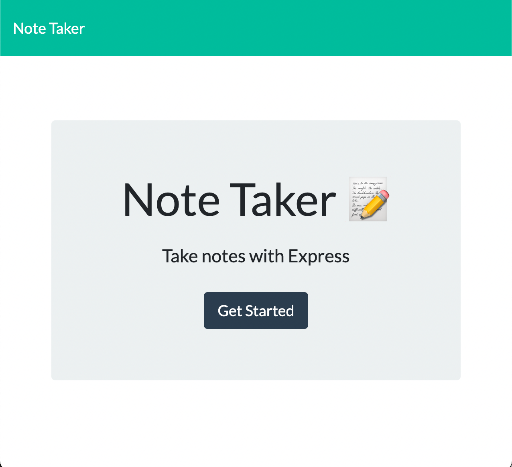
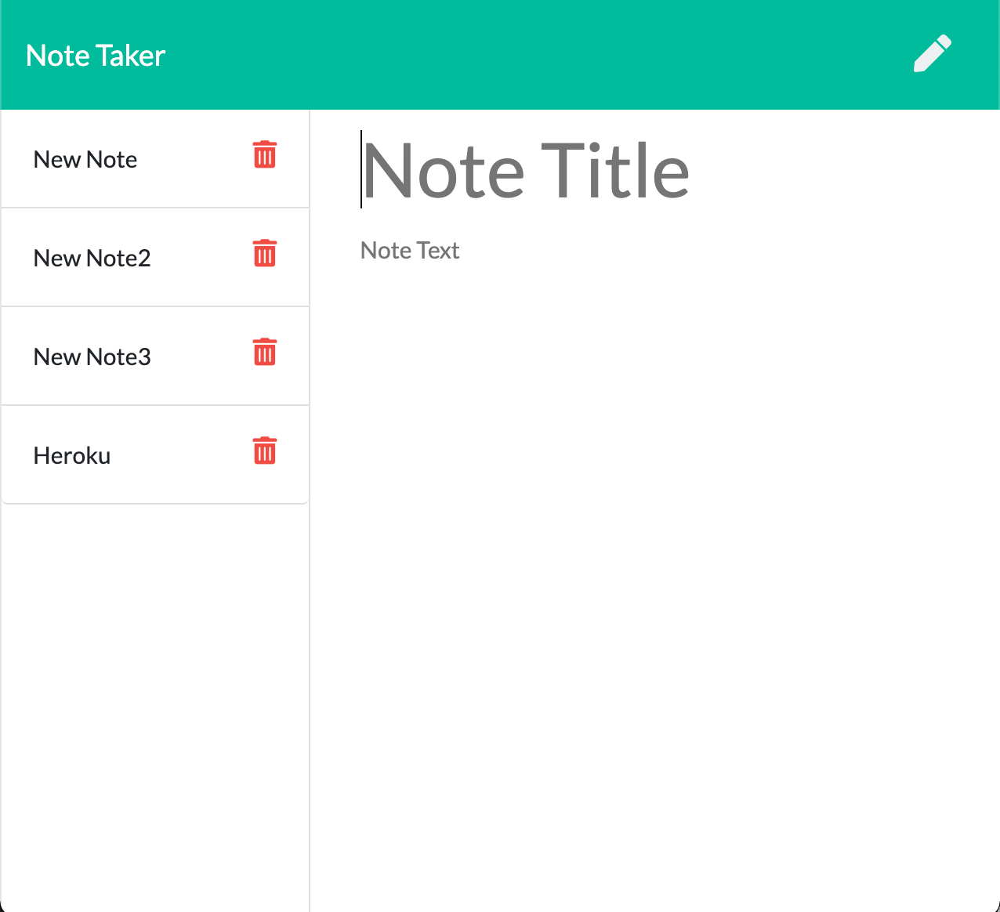

# Note Taker

An Express.js application that allows the user to write and save notes to keep track of action items and tasks.

## Table of Contents

- [Description](#note-taker)
- [Visuals](#visuals)
- [Contribute](#contribute)
- [Contact Me](#questions)
- [License](#license)

## Visuals

[DeployedApp] (<https://my-note-taker.herokuapp.com/>)

## Contribute

If you have something you'd like to contribute, make a pull request!

## Questions?

Please feel free to contact me with any questions via email or LinkedIn.

- Github: [NAHco-code](https://github.com/NAHco-code)
- LinkedIn: [kwilkinsonxx](https://www.linkedin.com/in/kwilkinsonxx/)
- Email: [kathrynxwilk@gmail.com](kathrynxwilk@gmail.com)

## License

This project is licensed under the MIT License.
For more information, please visit: [MIT](https://choosealicense.com/licenses/mit/)

&copy; 2021 Kathryn Wilkinson
